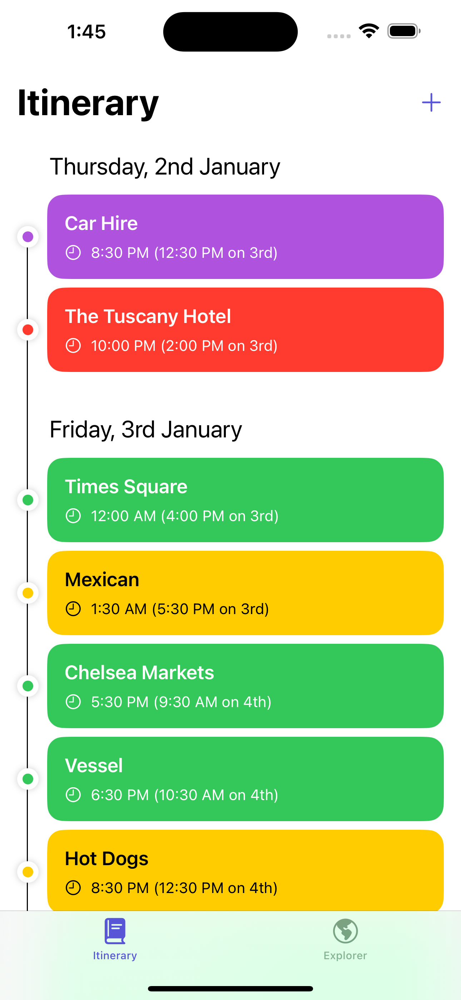
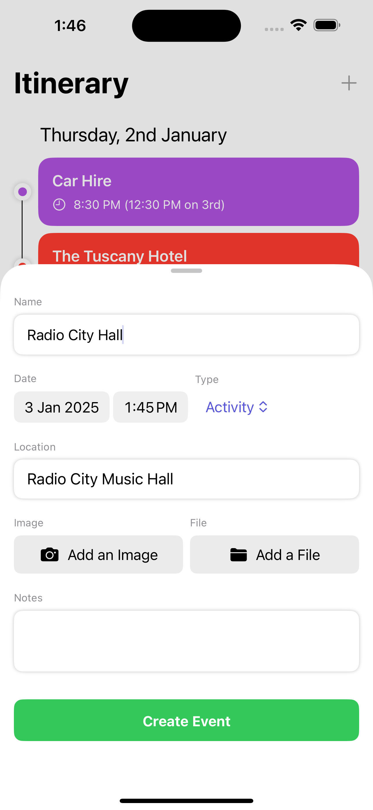
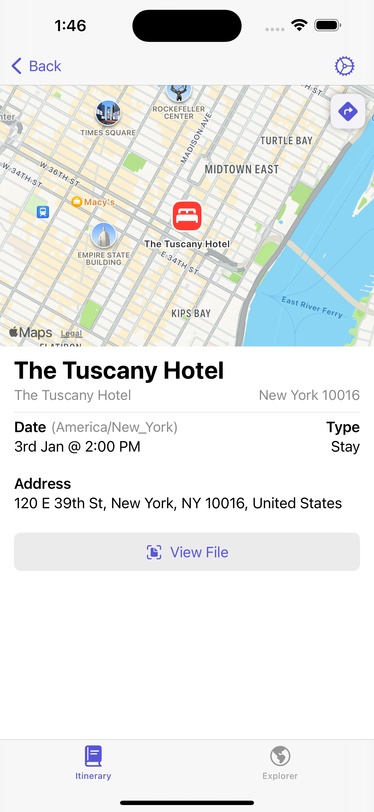
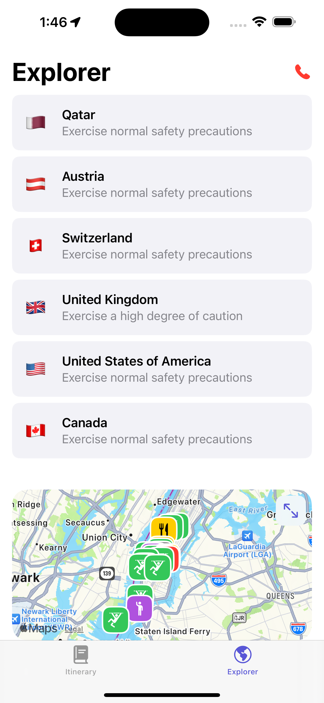
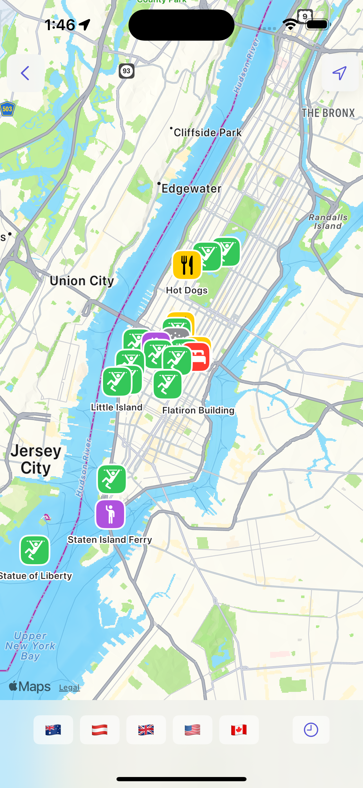
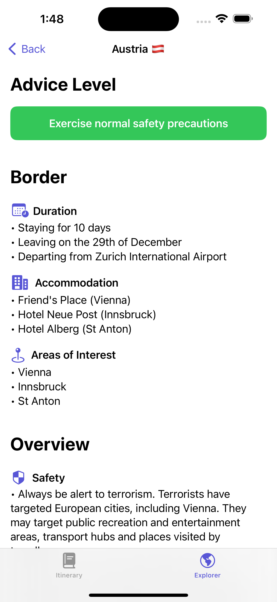

# Emmet

## Description

To solve a personal issue with planning and tracking bookings and activities for an upcoming international holiday, Emmet was created. Emmet is a simple, easy-to-use application that allows users to create and manage events including, activities, hotel and flight bookings, and more. This application is built using SwiftUI and Core Data + CloudKit for data persistence. This allows for seamless syncing of data across devices and platforms. To ensure safety while travelling, Emmet also includes a feature to store important information regarding the country of travel, taken from the Australian Smart Traveller Website. Finally, the user's general location is taken to display upcoming events in the current country, and to provide a dynamic single button for calling emergency services. 

## Technologies

- Swift
- SwiftUI
- Core Data + CloudKit

## Features

- Create, edit, and delete events
- Store important information regarding the country of travel
- Display upcoming events in the current location on a map
- Timezone support for events
- Automatic syncing of data across devices and platforms
- Call emergency services with a single button

## Screenshots

## Usage

To run this application, you need to have Xcode installed on your machine. Additionally, you must have an paid Apple Developer account to utilise CloudKit capabilities. 

1. Clone this repository
2. Open the project in Xcode
3. Create a CloudKit database in the Apple Developer portal
4. Update database references in Xcode to match your CloudKit database
5. Run the application on a simulator or physical device (note that you must be signed in to iCloud on the device)